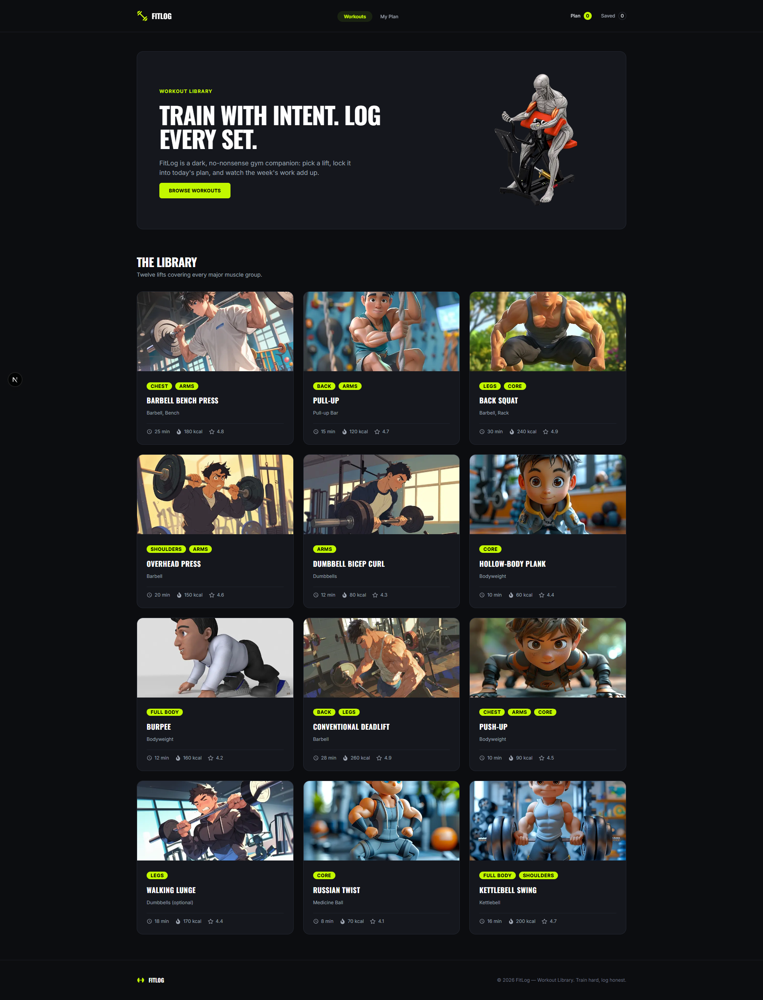
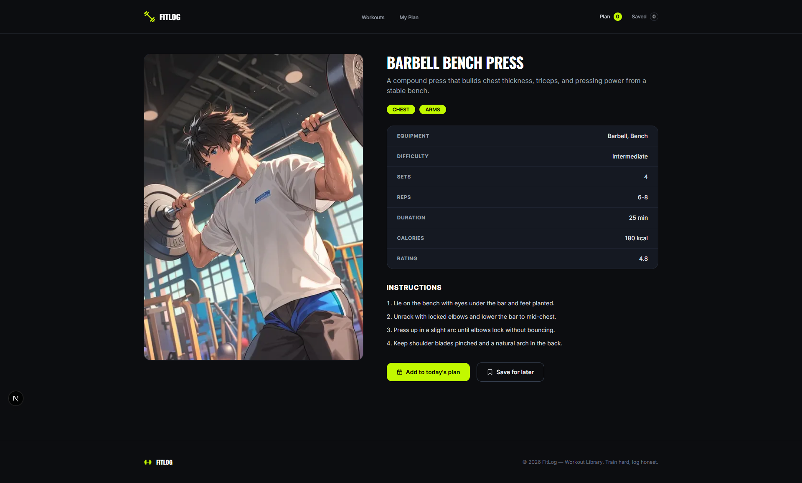
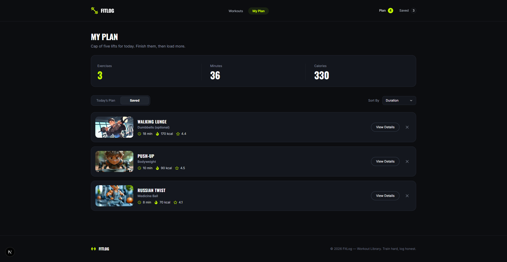
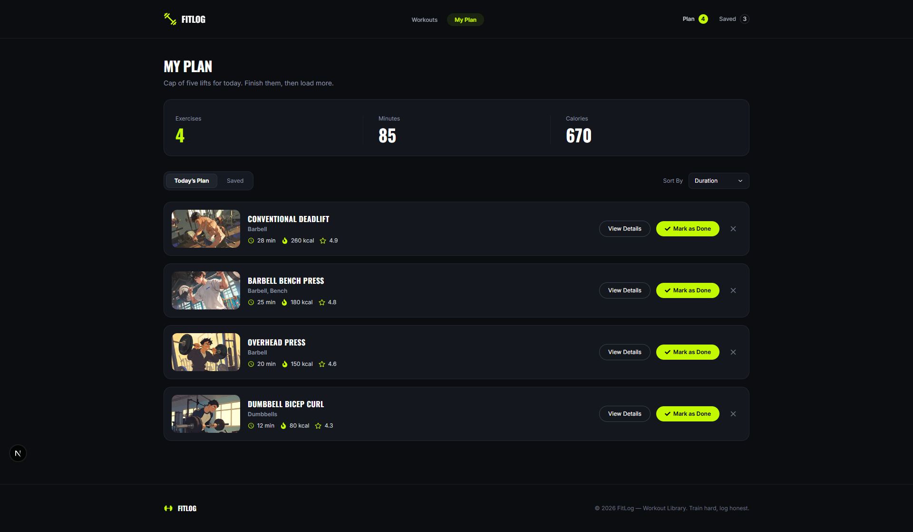

# 🏋️ Fit Log

> **TRAIN WITH INTENT. LOG EVERY SET.**

**Fit Log** is a dark, modern fitness companion built with **Next.js and TypeScript**. It helps users discover exercises, explore detailed workout information, and build focused workout plans.

The application provides a workout library covering major muscle groups, with information such as equipment, duration, estimated calories burned, difficulty, sets, reps, and ratings.

## 🌐 Live Demo

**[Visit Fit Log](https://fit-log-bd.vercel.app/)**

## 📸 Project Preview

<details>
  <summary><strong>🖼️ Project Screenshots</strong></summary>

<br />

<strong>Workouts</strong>



<br /><br />

<strong>Exercise Details</strong>



<br /><br />

<strong>Today's Plan</strong>



<br /><br />

<strong>Saved Plan</strong>



</details>

## ✨ Features

- 🏋️ **Workout Library** — Browse a library of exercises covering major muscle groups.
- 🔎 **Exercise Details** — View detailed information for individual exercises.
- 💪 **Muscle Group Tags** — Identify the primary muscle groups targeted by each exercise.
- 🧰 **Equipment Information** — See the equipment required for each exercise.
- 📊 **Difficulty Information** — View the difficulty level of each exercise.
- ⏱️ **Workout Duration** — View the estimated duration of each exercise.
- 🔥 **Calories Information** — See the estimated calories burned for each exercise.
- ⭐ **Exercise Ratings** — View ratings for individual exercises.
- 🔍 **Filter & Sort** — Filter and sort exercises using relevant criteria.
- 📋 **Workout Planning** — Add exercises to today's workout and organize your plan.
- 🔖 **Save Exercises** — Save exercises for later access.
- ✅ **Workout Tracking** — Mark planned exercises as completed.
- 📈 **Workout Statistics** — View statistics related to your workout activity.
- 💾 **Persistent Data** — Preserve workout plans and saved exercises using browser local storage.
- 🌙 **Dark Interface** — Focused dark-themed interface designed for a modern fitness experience.
- 📱 **Responsive Design** — Optimized for mobile, tablet, and desktop screens.
- 💀 **Loading Skeletons** — Display skeleton placeholders during loading states.
- 🚫 **Custom 404 Page** — Provide a dedicated page for invalid or unavailable routes.
- 🏷️ **Dynamic Metadata** — Generate metadata for individual exercise pages.

The exercise library currently contains **12 exercises** covering major muscle groups.

## 🛠️ Tech Stack

- **Next.js 16** — React framework and application framework
- **React 19** — UI library
- **TypeScript** — Type-safe development
- **Tailwind CSS 4** — Utility-first styling
- **React Icons** — Icon library
- **React Toastify** — Toast notifications
- **Context API** — Client-side workout plan state management
- **Local Storage** — Persistent client-side data
- **REST API** — Exercise data source
- **ESLint** — Code linting
- **Prettier** — Code formatting

## 📦 Dependencies

### Production Dependencies

```json
{
  "next": "16.3.6",
  "react": "19.2.8",
  "react-dom": "19.2.8",
  "react-icons": "^5.7.0",
  "react-toastify": "^11.1.0"
}
```

### Development Dependencies

```json
{
  "@tailwindcss/postcss": "^4",
  "@types/node": "^20",
  "@types/react": "^19",
  "@types/react-dom": "^19",
  "eslint": "^9",
  "eslint-config-next": "16.3.6",
  "prettier": "^3.9.9",
  "prettier-plugin-tailwindcss": "^0.8.1",
  "tailwindcss": "^4",
  "typescript": "^5"
}
```

## 🔌 API

Fit Log fetches exercise data from the project's REST API:

```text
http://api.abcz.workers.dev/api/fitlog
```

Individual exercises can be requested using their ID:

```text
http://api.abcz.workers.dev/api/fitlog/{id}
```

The exercise library fetches its data from this API on the server side.

## 📋 Prerequisites

Before running Fit Log locally, make sure you have the following installed:

- **Node.js**
- **npm**
- **Git**
- A modern web browser

You can check your installed versions with:

```bash
node --version
npm --version
git --version
```

## ⚙️ Installation

### 1. Clone the repository

```bash
git clone https://github.com/NazmulHossain2905/fit-log.git
```

### 2. Navigate to the project

```bash
cd fit-log
```

### 3. Install dependencies

```bash
npm install
```

### 4. Start the development server

```bash
npm run dev
```

Open the application at:

```text
http://localhost:3000
```

## 🏗️ Production Build

Create a production build:

```bash
npm run build
```

Start the production server:

```bash
npm run start
```

## 🧹 Linting

Run ESLint with:

```bash
npm run lint
```

## 📜 Available Scripts

| Command         | Description                  |
| --------------- | ---------------------------- |
| `npm run dev`   | Start the development server |
| `npm run build` | Create a production build    |
| `npm run start` | Start the production server  |
| `npm run lint`  | Run ESLint                   |

These scripts are defined in the project's `package.json`.

## 🔐 Environment Variables

No environment variables are required for the current version of Fit Log.

The API endpoint is currently defined directly in the application code, so you do not need to create a `.env` file to run the project.

## 📁 Project Structure

```text
fit-log/
├── .vscode/
│
├── public/
│   ├── assets/
│   │   └── ...
│   └── preview/
│       ├── fit-log-preview-1.png
│       ├── fit-log-preview-2.png
│       ├── fit-log-preview-3.png
│       └── fit-log-preview-4.png
│
├── src/
│   ├── apis/
│   │   └── exercise.ts
│   │
│   ├── app/
│   │   ├── exercise/
│   │   │   └── [id]/
│   │   │       ├── loading.tsx
│   │   │       └── page.tsx
│   │   │
│   │   ├── my-plan/
│   │   │   ├── _components/
│   │   │   │   └── MyPlanClient.tsx
│   │   │   ├── loading.tsx
│   │   │   └── page.tsx
│   │   │
│   │   ├── globals.css
│   │   ├── icon.png
│   │   ├── layout.tsx
│   │   ├── not-found.tsx
│   │   └── page.tsx
│   │
│   ├── components/
│   │   ├── exercise/
│   │   │   ├── [id]/
│   │   │   │   └── AddAndSaveButtons.tsx
│   │   │   ├── ExerciseCard.tsx
│   │   │   ├── ExerciseGrid.tsx
│   │   │   ├── ExerciseLibrary.tsx
│   │   │   ├── ExerciseLoading.tsx
│   │   │   └── Hero.tsx
│   │   │
│   │   ├── my-plan/
│   │   │   ├── EmptyPlan.tsx
│   │   │   ├── ExercisesStats.tsx
│   │   │   ├── PlanCard.tsx
│   │   │   ├── PlanLoading.tsx
│   │   │   ├── SavedPlans.tsx
│   │   │   ├── TabSegment.tsx
│   │   │   └── TodaysPlans.tsx
│   │   │
│   │   ├── Footer.tsx
│   │   ├── Navbar.tsx
│   │   └── SelectDropdown.tsx
│   │
│   ├── contexts/
│   │   └── ExerciseContext.tsx
│   │
│   ├── hooks/
│   │   └── useExercise.ts
│   │
│   └── interfaces/
│       └── IExercise.ts
│
├── .gitignore
├── .prettierrc
├── eslint.config.mjs
├── next.config.ts
├── package.json
├── package-lock.json
├── postcss.config.mjs
├── tsconfig.json
└── README.md
```

### Main Application Flow

The homepage uses the `Hero`, `ExerciseLibrary`, and `ExerciseGrid` components to present the workout library.

Exercises are fetched from the REST API and rendered through individual `ExerciseCard` components.

Individual exercises are accessible through dynamic routes:

```text
/exercise/[id]
```

The `My Plan` section manages today's workout plan and saved exercises using client-side state and local storage.

## 🏋️ Exercise Information

Each exercise provides information such as:

- Exercise name
- Target muscle groups
- Equipment
- Difficulty
- Duration
- Estimated calories burned
- Sets
- Reps
- Rating
- Exercise image

Each exercise card links to its corresponding exercise details page using the exercise ID.

## 🏋️ Workout Library

The current application provides the following 12 exercises:

| Exercise              | Muscle Group         | Equipment      |
| --------------------- | -------------------- | -------------- |
| Barbell Bench Press   | Chest, Arms          | Barbell, Bench |
| Pull-Up               | Back, Arms           | Pull-up Bar    |
| Back Squat            | Legs, Core           | Barbell, Rack  |
| Overhead Press        | Shoulders, Arms      | Barbell        |
| Dumbbell Bicep Curl   | Arms                 | Dumbbells      |
| Hollow-Body Plank     | Core                 | Bodyweight     |
| Burpee                | Full Body            | Bodyweight     |
| Conventional Deadlift | Back, Legs           | Barbell        |
| Push-Up               | Chest, Arms, Core    | Bodyweight     |
| Walking Lunge         | Legs                 | Dumbbells      |
| Russian Twist         | Core                 | Medicine Ball  |
| Kettlebell Swing      | Full Body, Shoulders | Kettlebell     |

## 📋 My Plan

The **My Plan** section allows users to manage their selected exercises.

Users can:

- Add exercises to today's workout plan
- Save exercises for later
- Mark exercises as completed
- Remove exercises from their plans
- View workout statistics
- Sort exercises by duration, rating, or calories
- Switch between today's plan and saved exercises

Workout plans and saved exercises are stored in **localStorage**, allowing them to remain available after refreshing or reopening the browser.

## 📱 Responsive Design

Fit Log is designed to work across:

- 📱 Mobile
- 📱 Tablet
- 💻 Desktop

The interface adapts its layout, spacing, typography, and exercise cards based on the screen size.

## 🎨 Design

Fit Log uses a dark, fitness-focused interface with:

- Dark backgrounds
- High-contrast typography
- Rounded cards
- Minimal borders
- Responsive layouts
- Skeleton loading states
- Clear workout-focused visual hierarchy

## 🔮 Future Improvements

Potential future improvements include:

- User authentication
- Cloud-synced workout plans
- Workout history
- Long-term progress tracking
- Custom workout creation
- Exercise search
- More advanced filtering
- Personal fitness goals
- Workout reminders

## 🔗 Useful Links

- 🌐 **[Live Demo](https://fit-log-bd.vercel.app/)**
- 💻 **[GitHub Repository](https://github.com/NazmulHossain2905/fit-log)**
- 🔌 **[Fit Log API](http://api.abcz.workers.dev/api/fitlog)**
- ▲ **[Next.js Documentation](https://nextjs.org/docs)**
- ⚛️ **[React Documentation](https://react.dev/)**
- 🎨 **[Tailwind CSS Documentation](https://tailwindcss.com/docs)**
- 📘 **[TypeScript Documentation](https://www.typescriptlang.org/docs/)**
- 🧩 **[React Icons](https://react-icons.github.io/react-icons/)**

## 👨‍💻 Author

**Nazmul Hossain**

- GitHub: [@NazmulHossain2905](https://github.com/NazmulHossain2905)
- Repository: [Fit Log](https://github.com/NazmulHossain2905/fit-log)

---

Built with ❤️ using **Next.js, React, TypeScript & Tailwind CSS**.

⭐ If you find this project useful, consider giving the repository a star.
